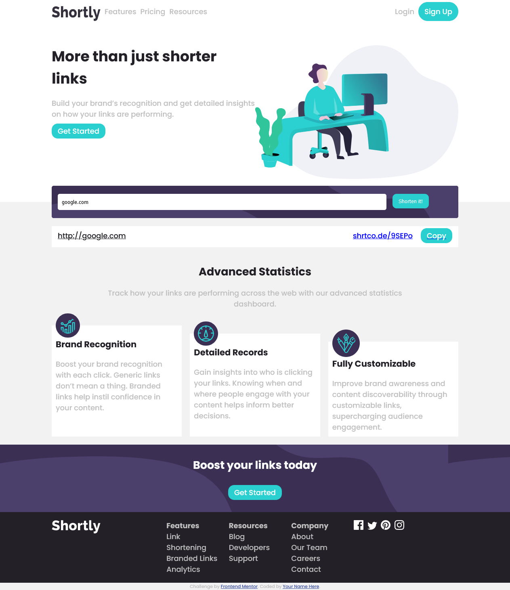

# Frontend Mentor - Shortly URL shortening API Challenge solution

This is a solution to the [Shortly URL shortening API Challenge challenge on Frontend Mentor](https://www.frontendmentor.io/challenges/url-shortening-api-landing-page-2ce3ob-G). Frontend Mentor challenges help you improve your coding skills by building realistic projects. 

## Table of contents


  - [The challenge](#the-challenge)
  - [Screenshot](./screenshot.png)
  - [Links](https://stoic-noyce-c30fb2.netlify.app/#)
  - [Built with](#vanillajs)
  - [What I learned](#event bubbling, dynamically creating elements)
  - [Continued development](#local storage)
  - [Useful resources](#mdn docs)
- [Author](#femi Efejuku)
- [Acknowledgments](#stackoverflow and the junior dev whatsapp group who always help )


## Overview

### The challenge

Users should be able to:

- View the optimal layout for the site depending on their device's screen size
- Shorten any valid URL
- See a list of their shortened links, even after refreshing the browser
- Copy the shortened link to their clipboard in a single click
- Receive an error message when the `form` is submitted if:
  - The `input` field is empty

### Screenshot




### Links

- Solution URL: [Add solution URL here](https://www.frontendmentor.io/challenges/url-shortening-api-landing-page-2ce3ob-G/hub/site-integrated-with-shrtcode-api-VlWVSPxtf)
- Live Site URL: [Add live site URL here](https://stoic-noyce-c30fb2.netlify.app/#)

## My process

### Built with

- Semantic HTML5 markup
- CSS custom properties
- Flexbox
- CSS Grid
- vanilla js
) - For styles

**Note: These are just examples. Delete this note and replace the list above with your own choices**

### What I learned

I understand javascript at the same time I do not understand it. Using it as building blocks has been an issue but I've learnt a lot making this project

To see how you can add code snippets, see below:


```
```js
function result(url){
    fetch(`https://api.shrtco.de/v2/shorten?url=${url}`)
    .then(res => res.json())
    .then(data =>{
        if (data.ok){
        var data= data
        results.innerHTML = `<div class="result">
        <div class="sent">${data.result.original_link}</div>
        <div class="shortened" id="short"><div>${data.result.short_link}</div>
        <div class="copy-wrapper"></div><a href="#" class="copy" onClick="copyLink('${data.result.short_link}')">Copy</a></div>
        </div>`
        // create div 
        
        answer.appendChild(results)
       localStorage.setItem('shortenedLink',results.innerHTML )
        console.log(localStorage.getItem('shortenedLink'))
        
    }else {
        alert('incorrect url')

    }
    mainBtn.innerHTML = "Shorten it!"
    
 
    })
  
  
 }
```


### Useful resources

- [resource 1](https://developer.mozilla.org/en-US/docs/Web/API/Storage/setItem) - This helped me understand local storage. I really liked this pattern and will use it going forward.


## Author

- Website - [Add your name here](https://www.your-site.com)
- Frontend Mentor - [@femizi](https://www.frontendmentor.io/profile/femizi)
- Twitter - [@sonofpharoh](https://www.twitter.com/sonofpharoh)


## Acknowledgments

shout out morgan jay and abisalade you guys rock
